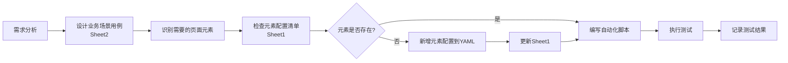

# 测试用例体系说明

## 📑 概述

本项目采用**双层测试用例体系**，分别服务于不同的目的和受众。

```
all_testcases.xlsx
├── Sheet1: 元素配置清单 (技术层面)
│   └── 31个元素定位器配置
│
└── Sheet2: 业务场景测试用例 (业务层面)
    └── 12个完整业务流程测试
```

---

## 🔍 两层用例对比

### 维度对比表

| 维度 | Sheet1: 元素配置清单 | Sheet2: 业务场景测试用例 |
|------|---------------------|-------------------------|
| **粒度** | 细（单个元素） | 粗（完整流程） |
| **视角** | 技术实现视角 | 业务功能视角 |
| **内容** | 元素定位器、操作类型 | 测试步骤、预期结果 |
| **用途** | 代码维护、元素管理 | 测试执行、回归验证 |
| **更新频率** | 高（UI变更时） | 低（需求变更时） |
| **受众** | 自动化工程师、开发人员 | 测试人员、产品经理、业务方 |
| **可读性** | 需要技术背景 | 业务人员也能理解 |
| **示例** | TC-PROD-001: backpack_add元素 | TC-E2E-001: 完整购物流程 |

---

## 📊 Sheet1: 元素配置清单详解

### 定位
**技术资产清单** - 记录所有页面元素的定位器配置

### 核心价值
1. **元素集中管理**: 所有页面的元素定位器一目了然
2. **配置版本追踪**: 区分旧版(testcase/check)和新版(elements)格式
3. **快速查找**: 通过键名或索引快速定位元素
4. **维护便利**: UI变更时只需修改对应行的配置

### 数据结构
```
用例编号 | 页面名称 | 模块 | 元素键名 | 元素描述 | 定位方式 | 定位值 | 操作类型 | 配置格式 | 备注
```

### 典型使用场景
```python
# 场景1: 开发新测试用例时查找元素
# 问题: "购物车移除按钮的定位器是什么？"
# 解决: 在Sheet1中搜索"remove_button" → 找到 class_name: cart_button

# 场景2: UI变更后更新配置
# 问题: "商品ID从 'add-to-cart-xxx' 改为 'btn-add-xxx'"
# 解决: 在Sheet1中找到对应行，更新G列的定位值

# 场景3: 检查元素命名规范
# 问题: "所有添加按钮是否都遵循 xxx_add 命名？"
# 解决: 筛选D列，查看所有添加按钮的键名
```

### 统计数据
- **总元素数**: 31个
- **登录页面**: 7个（旧版格式）
- **商品页面**: 15个（新版格式）
- **购物车页面**: 9个（新版格式）

---

## 📋 Sheet2: 业务场景测试用例详解

### 定位
**业务测试指南** - 记录完整的端到端测试场景

### 核心价值
1. **业务流程覆盖**: 确保核心业务场景都被测试到
2. **优先级管理**: P0/P1/P2分级，指导测试资源分配
3. **回归测试基准**: 版本更新后的标准测试套件
4. **沟通桥梁**: 测试、产品、开发之间的共同语言

### 数据结构
```
用例编号 | 用例标题 | 优先级 | 模块 | 涉及页面 | 前置条件 | 测试步骤 | 测试数据 | 预期结果 | 用例类型 | 备注
```

### 优先级定义

#### P0 - 主流程（必须通过）
- **定义**: 核心业务流程，阻断性问题
- **数量**: 4个
- **示例**:
  - TC-E2E-001: 完整购物流程
  - TC-E2E-002: 多商品添加到购物车
  - TC-LOGIN-E2E-001: 有效用户登录并登出
  - TC-E2E-006: 登录后验证商品页面加载

#### P1 - 重要功能（应该通过）
- **定义**: 重要功能点，影响用户体验
- **数量**: 6个
- **示例**:
  - TC-E2E-003: 从购物车移除商品
  - TC-E2E-004: 继续购物返回商品页
  - TC-LOGIN-E2E-002: 无效密码登录失败
  - TC-PROD-E2E-001: 浏览所有商品并验证信息
  - TC-CART-E2E-001: 购物车商品价格验证
  - TC-E2E-007: 商品添加和移除组合操作

#### P2 - 一般功能（可以通过）
- **定义**: 边界情况、用户体验优化
- **数量**: 2个
- **示例**:
  - TC-E2E-005: 空购物车状态验证
  - TC-NAV-E2E-001: 页面间导航流畅性测试

### 用例类型分布

| 类型 | 数量 | 说明 |
|------|------|------|
| 主流程 | 4 | 核心业务流程，每次必测 |
| 功能测试 | 5 | 具体功能点的验证 |
| 异常测试 | 1 | 错误处理和异常情况 |
| 边界测试 | 1 | 边界条件和极端情况 |
| 数据验证 | 1 | 数据准确性和一致性 |
| 用户体验 | 1 | 交互流畅性和易用性 |

### 典型使用场景
```markdown
# 场景1: 制定测试计划
问题: "新版本发布前需要测试哪些场景？"
解决: 
- P0用例: 全部执行（4个）
- P1用例: 根据改动模块选择（6个中选相关）
- P2用例: 时间允许时执行（2个）

# 场景2: 回归测试
问题: "修复bug后如何验证没有引入新问题？"
解决: 执行所有P0+P1用例（10个），确保核心功能正常

# 场景3: 缺陷复现
问题: "用户报告购物车价格显示错误"
解决: 
- 查找相关用例: TC-CART-E2E-001
- 按照测试步骤复现
- 对比预期结果和实际结果

# 场景4: 需求评审
问题: "新功能'收藏夹'需要哪些测试场景？"
解决: 
- 参考现有用例结构
- 设计类似场景: TC-FAV-E2E-001: 添加商品到收藏夹
- 补充到Sheet2中
```

---

## 🔄 两层用例的关系

### 映射关系
```
业务场景用例 (Sheet2)          元素配置清单 (Sheet1)
━━━━━━━━━━━━━━━━━━━━━        ━━━━━━━━━━━━━━━━━━━
TC-E2E-001: 完整购物流程  ←→  TC-LOGIN-001~005 (登录元素)
                               TC-PROD-001~006 (添加商品元素)
                               TC-PROD-013 (购物车链接)
                               TC-CART-001~009 (购物车元素)

TC-E2E-003: 移除商品      ←→  TC-PROD-007~012 (移除按钮)
                               TC-CART-003 (移除操作)
```

### 协同工作流


---

## 💡 最佳实践

### 1. 日常维护

#### Sheet1 (元素配置)
- ✅ UI变更时立即更新
- ✅ 保持键名语义化（如 `backpack_add` 而非 `btn1`）
- ✅ 优先使用 id > class_name > css_selector > xpath
- ❌ 不要删除仍在使用的元素
- ❌ 避免重复配置相同元素

#### Sheet2 (业务场景)
- ✅ 新功能上线前补充对应用例
- ✅ 定期review P0用例的完整性
- ✅ 根据缺陷补充遗漏的场景
- ❌ 不要过度细化步骤（保持业务视角）
- ❌ 避免重复的业务场景

### 2. 版本迭代

#### 小版本（Bug修复）
- 执行: 所有P0用例
- 选择性执行: 相关P1用例
- 更新: Sheet1（如有UI调整）

#### 中版本（功能增强）
- 执行: 所有P0+P1用例
- 新增: 相关P1/P2用例
- 更新: Sheet1 + Sheet2

#### 大版本（架构重构）
- 执行: 所有用例（P0+P1+P2）
- 全面review: 两层用例
- 可能重构: YAML配置结构

### 3. 团队协作

#### 自动化工程师
- 主要使用: Sheet1（元素配置）
- 参考: Sheet2（了解业务场景）
- 职责: 维护YAML配置、编写测试脚本

#### 测试工程师
- 主要使用: Sheet2（业务场景）
- 参考: Sheet1（了解技术实现）
- 职责: 设计测试场景、执行回归测试

#### 产品经理
- 主要使用: Sheet2（业务场景）
- 职责: Review用例覆盖度、补充业务场景

#### 开发人员
- 主要使用: Sheet1（元素配置）
- 参考: Sheet2（理解测试范围）
- 职责: UI变更时通知测试团队更新配置

---

## 📈 度量指标

### 测试覆盖率
```
元素覆盖率 = Sheet1中元素数 / 页面实际元素数
场景覆盖率 = Sheet2中用例数 / 业务场景总数
```

### 用例质量
```
P0用例占比 = P0用例数 / 总用例数  (目标: 30-40%)
P1用例占比 = P1用例数 / 总用例数  (目标: 40-50%)
P2用例占比 = P2用例数 / 总用例数  (目标: 10-20%)
```

### 维护效率
```
元素更新耗时 = UI变更到Sheet1更新的平均时间
用例执行耗时 = 执行一轮回归测试的平均时间
缺陷发现率 = 通过用例发现的缺陷数 / 总缺陷数
```

---

## 🎯 下一步建议

### 短期（1-2周）
1. ✅ 已完成: 创建两层用例体系
2. 🔄 进行中: 补充更多P1/P2用例
3. 📝 待完成: 将现有自动化脚本与Sheet2用例关联

### 中期（1-2月）
1. 建立用例执行跟踪机制
2. 集成到CI/CD流程
3. 生成自动化测试报告

### 长期（3-6月）
1. 扩展到更多页面（结算、个人中心等）
2. 引入用例管理平台（如TestLink、Zephyr）
3. 建立用例评审和优化机制

---

## 📚 相关文档

- [README_EXCEL.md](./README_EXCEL.md) - Excel文件详细说明
- [YAML_CONFIG_GUIDE.md](../YAML_CONFIG_GUIDE.md) - YAML配置指南
- [SCHEME4_MIGRATION.md](../SCHEME4_MIGRATION.md) - 方案四改进说明

---

**文档版本**: v1.0  
**最后更新**: 2026-05-13  
**维护者**: 自动化测试团队
